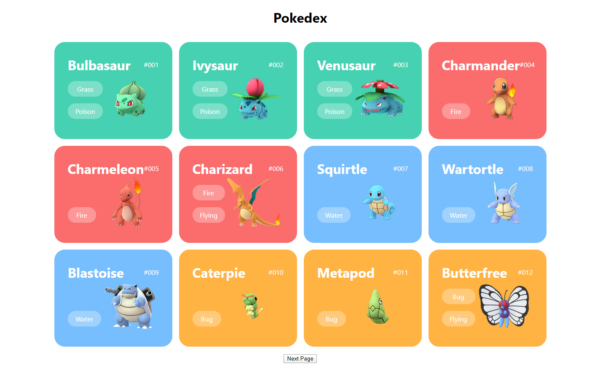

# Pokedex app

Simple pokedex app created with React and JSON-server.



## To do:

- [x] List your pokemons
- [ ] Add loading spinner (pokeball probably)
- [x] Pagination
- [ ] 'Click' for more info
- [ ] Favorites pokemons

## Getting Started

These instructions will get you a copy of the project up and running on your local machine for development and testing purposes. See deployment for notes on how to deploy the project on a live system.

### Installing

A step by step:

First - clone or download the repository and navigate to root directory

```
https://github.com/rafalmoneta/pokedex-app.git
```

Then install dependencies

```
npm install
```

After the installation is completed, start your react-app

```
npm run start
```

Then start your json-server

```
npm run server
```

## Built With

* [create-react-app](https://github.com/facebook/create-react-app) - react starter
* [json-server](https://github.com/typicode/json-server) - full fake REST API
* [axios](https://github.com/axios/axios) - Used to GET data


## License

This project is licensed under the MIT License - see the [LICENSE.md](LICENSE.md) file for details
